# Module Flow & Sequence Diagrams

This document contains flow and sequence diagrams for every module in the AI Recruitment System.

---

## Table of Contents

1. [Authentication Module](#1-authentication-module)
2. [Candidate Module](#2-candidate-module)
3. [HR Module](#3-hr-module)
4. [Jobs Module](#4-jobs-module)
5. [Applications Module](#5-applications-module)
6. [CV Analysis & Scoring Module](#6-cv-analysis--scoring-module)
7. [Quiz Module](#7-quiz-module)
8. [Email Notification Module](#8-email-notification-module)
9. [Matching Module](#9-matching-module)
10. [Dashboard & Analytics Module](#10-dashboard--analytics-module)

---

## 1. Authentication Module

### 1.1 Registration Flow

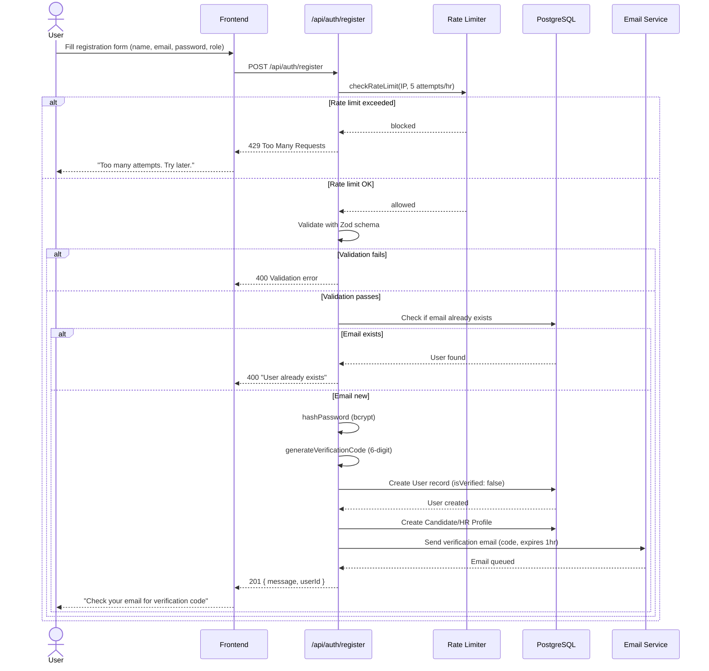

### 1.2 Email Verification Flow

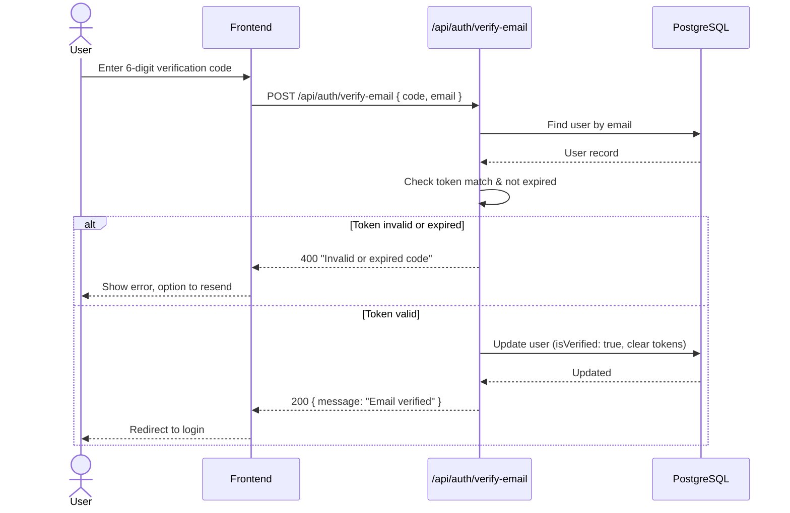

### 1.3 Login Flow

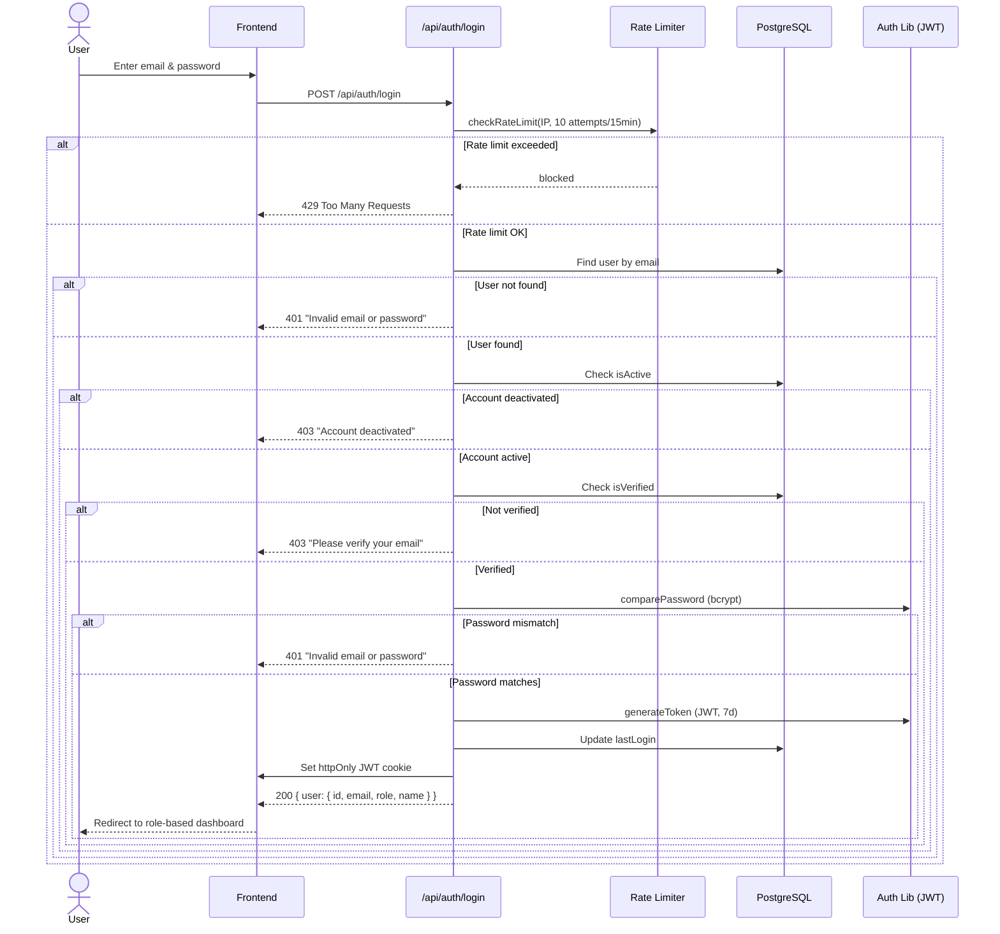

### 1.4 Password Reset Flow

```mermaid
flowchart TD
    A([User forgets password]) --> B[Request reset\n/api/auth/forgot-password]
    B --> C{Email exists?}
    C -- No --> D[Return generic success\nto prevent enumeration]
    C -- Yes --> E[Generate reset token + expiry 1hr]
    E --> F[Save token to DB]
    F --> G[Send reset email with link]
    G --> H([User clicks link])
    H --> I[/api/auth/reset-password\ntoken + new password]
    I --> J{Token valid\n& not expired?}
    J -- No --> K[400 Invalid/expired token]
    J -- Yes --> L[Hash new password]
    L --> M[Update password in DB]
    M --> N[Clear reset token]
    N --> O([Redirect to login])
```

---

## 2. Candidate Module

### 2.1 Candidate Profile Setup Flow

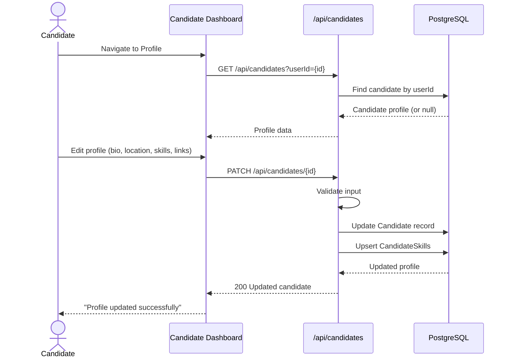

### 2.2 Resume Upload & Parsing Flow

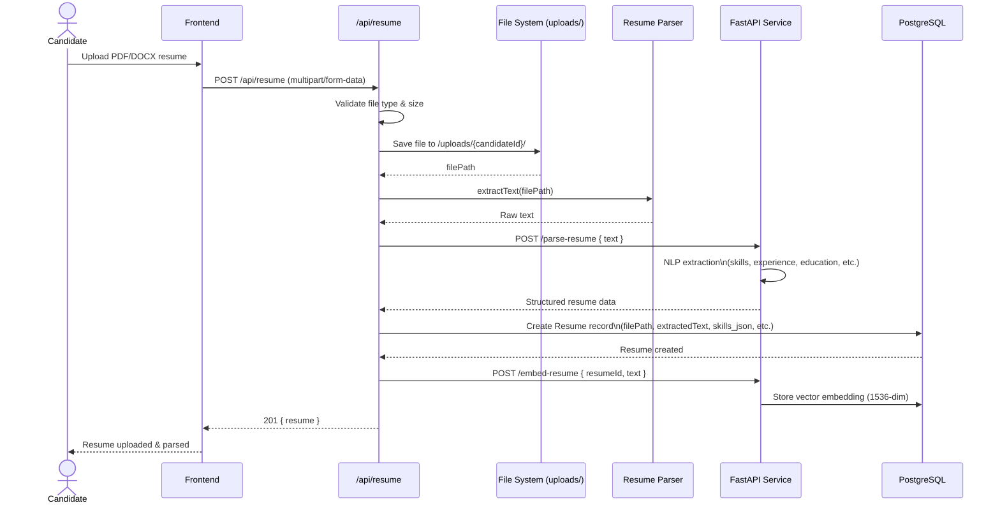

### 2.3 Avatar Upload Flow

```mermaid
flowchart TD
    A([Candidate selects image]) --> B[POST /api/upload/avatar]
    B --> C{Valid image?\njpg/png/webp, max 5MB}
    C -- No --> D[400 Invalid file]
    C -- Yes --> E[Convert to WebP via Sharp]
    E --> F[Resize to 256×256]
    F --> G[Save to /uploads/avatars/{userId}.webp]
    G --> H[Update user.avatarUrl in DB]
    H --> I([Return new avatar URL])
```

---

## 3. HR Module

### 3.1 HR Onboarding & Company Setup Flow

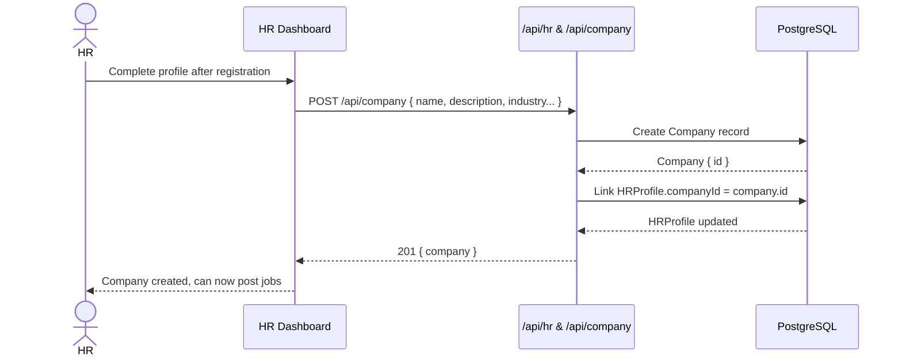

### 3.2 Manage Candidates (HR View)

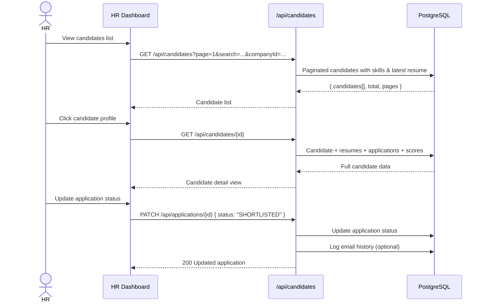

---

## 4. Jobs Module

### 4.1 Job Posting Flow (HR)

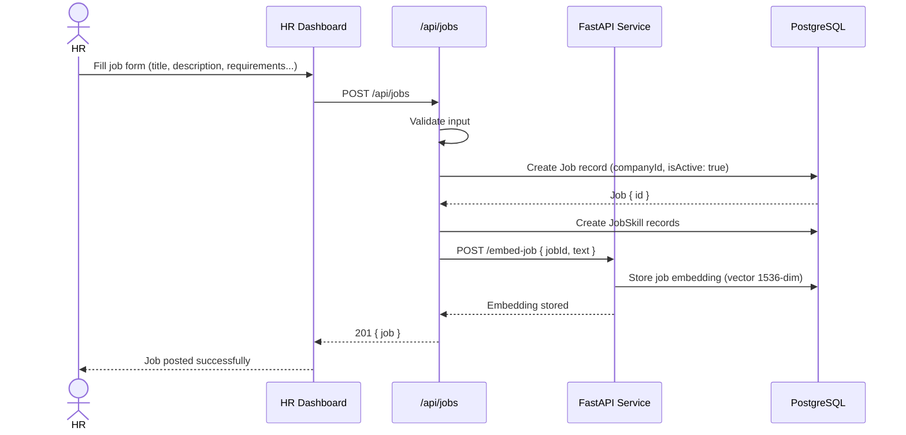

### 4.2 Job Browse & Apply Flow (Candidate)

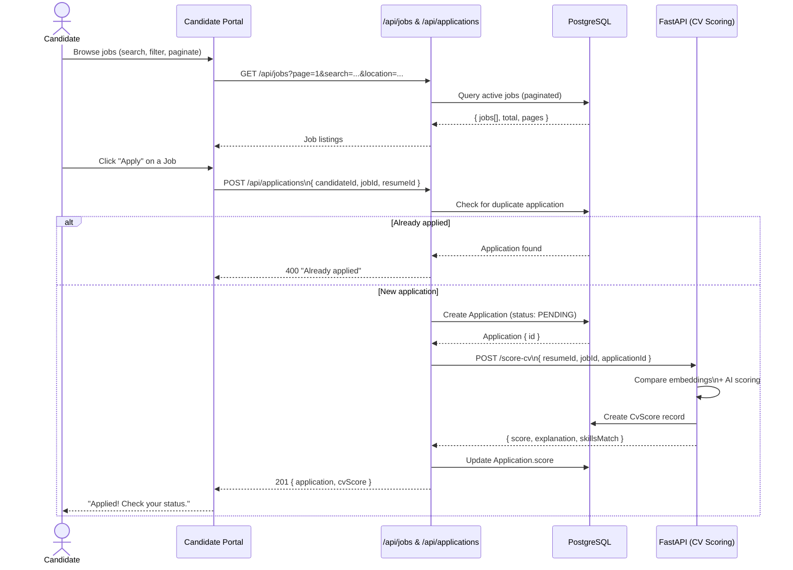

---

## 5. Applications Module

### 5.1 Application Lifecycle Flow

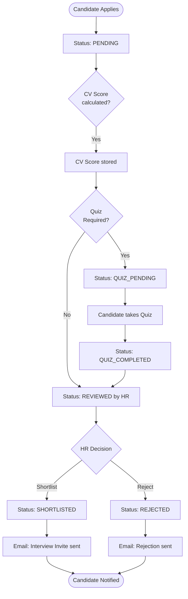

### 5.2 Application Status Update Sequence (HR)

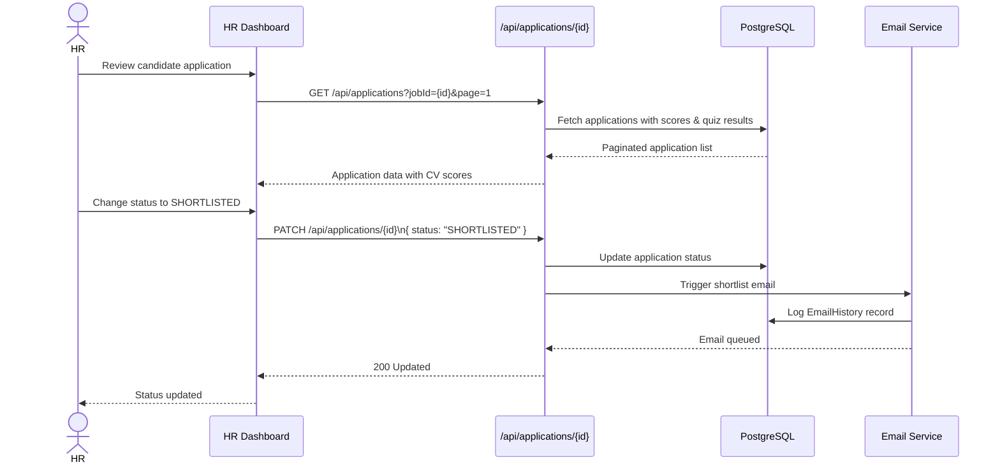

---

## 6. CV Analysis & Scoring Module

### 6.1 CV Scoring Flow

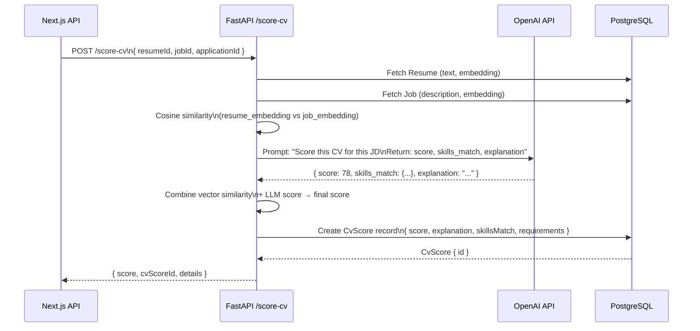

### 6.2 CV Analysis Detail View

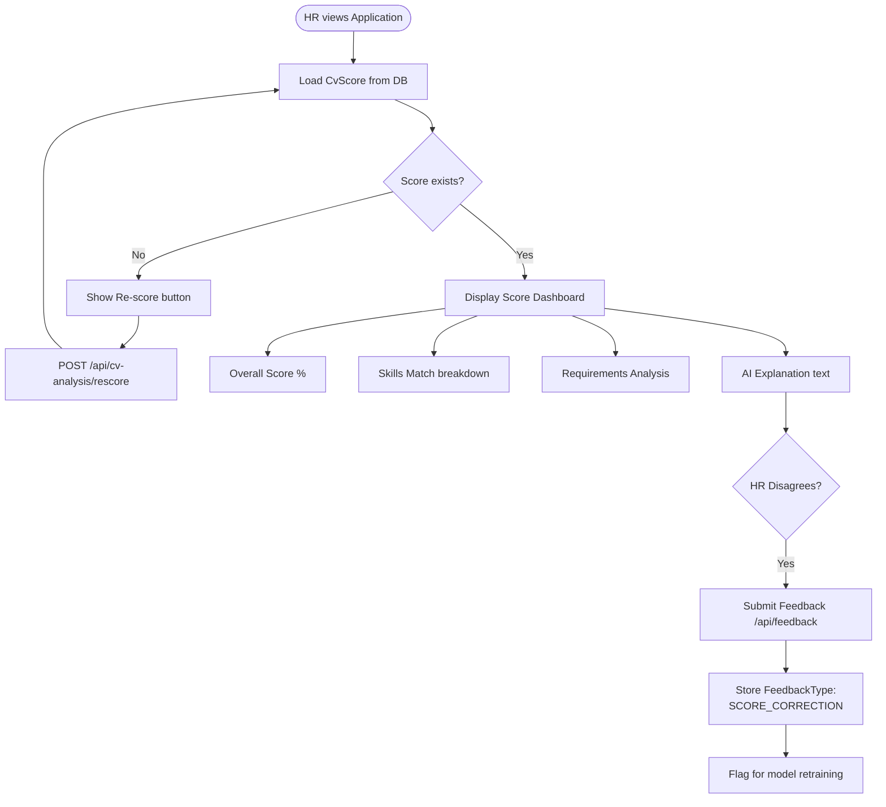

---

## 7. Quiz Module

### 7.1 Quiz Generation Flow

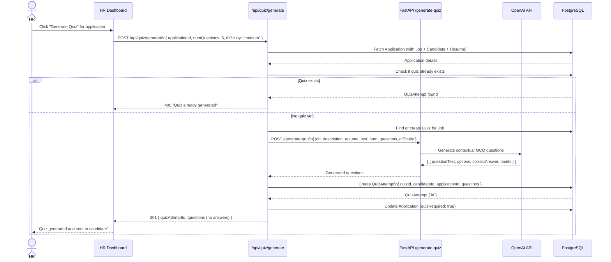

### 7.2 Candidate Quiz Attempt Flow

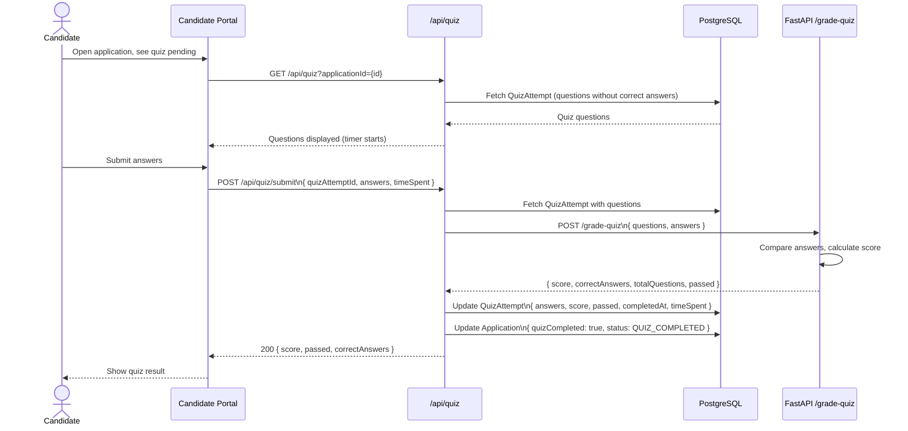

### 7.3 Quiz Result & Application Update Flow

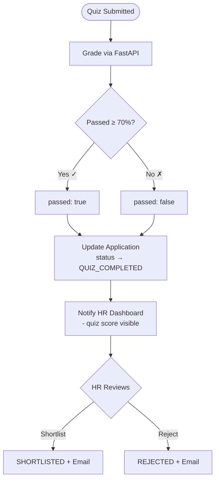

---

## 8. Email Notification Module

### 8.1 Email Send Flow

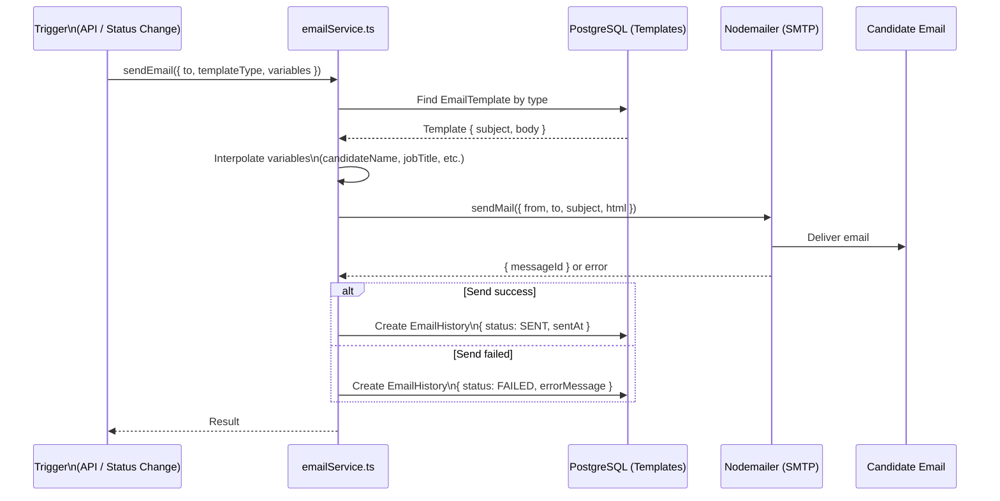

### 8.2 Email Types & Triggers

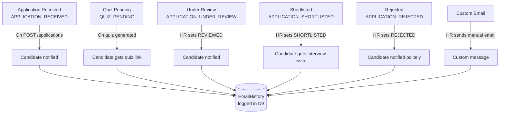

---

## 9. Matching Module

### 9.1 Candidate–Job Vector Matching Flow

```mermaid
sequenceDiagram
    participant API as Next.js /api/match
    participant DB as PostgreSQL + pgvector
    participant FastAPI as FastAPI /match

    Note over API,FastAPI: Triggered on demand or during application

    API->>DB: Fetch candidate embedding (vector 1536)
    API->>DB: Fetch job embedding (vector 1536)
    DB-->>API: Both embeddings

    API->>FastAPI: POST /match\n{ candidate_embedding, job_embedding }
    FastAPI->>FastAPI: Cosine Similarity calculation
    FastAPI-->>API: { similarity_score: 0.87 }

    API-->>FE: Match percentage (87%)
```

### 9.2 Bulk Matching (Find Best Candidates for Job)

```mermaid
flowchart TD
    A([HR clicks 'Find Matches'\nfor a Job]) --> B[GET /api/match?jobId={id}]
    B --> C[Fetch Job embedding from DB]
    C --> D[pgvector: SELECT candidates\nORDER BY embedding <=> job_embedding\nLIMIT 20]
    D --> E[Return top 20 candidates\nby vector similarity]
    E --> F[Fetch their CvScores\nif applications exist]
    F --> G[Combine: vector score + CV score → rank]
    G --> H([Display ranked candidate list\nwith match %])
```

### 9.3 Skill Extraction & Matching Detail

```mermaid
sequenceDiagram
    participant Resume as Resume Text
    participant SkillLib as skillExtraction.ts
    participant FastAPI as FastAPI /extract-skills
    participant DB as PostgreSQL

    Resume->>SkillLib: extractSkills(resumeText)
    SkillLib->>FastAPI: POST /extract-skills { text }
    FastAPI->>FastAPI: NLP / regex skill extraction
    FastAPI-->>SkillLib: [ "Python", "React", "SQL", ... ]
    SkillLib->>DB: Upsert Skill records
    SkillLib->>DB: Create CandidateSkill records
    DB-->>SkillLib: skills saved

    Note over SkillLib,DB: Same done for Job skills on job creation
```

---

## 10. Dashboard & Analytics Module

### 10.1 HR Dashboard Data Flow

```mermaid
sequenceDiagram
    actor HR
    participant FE as HR Dashboard
    participant API as /api/dashboard & /api/analytics
    participant DB as PostgreSQL

    HR->>FE: Open Dashboard
    FE->>API: GET /api/dashboard?companyId={id}
    API->>DB: COUNT active jobs for company
    API->>DB: COUNT total applications (by status)
    API->>DB: COUNT pending reviews
    API->>DB: AVG cv_score for recent applications
    DB-->>API: Aggregated stats
    API-->>FE: { totalJobs, totalApplications,\npending, shortlisted, avgScore }

    FE->>API: GET /api/analytics?companyId={id}
    API->>DB: Applications per job (bar chart data)
    API->>DB: Status distribution (pie chart data)
    API->>DB: Applications over time (line chart data)
    DB-->>API: Chart datasets
    API-->>FE: Analytics data
    FE-->>HR: Rendered charts & KPIs
```

### 10.2 Candidate Dashboard Data Flow

```mermaid
sequenceDiagram
    actor Candidate
    participant FE as Candidate Dashboard
    participant API as Next.js API Routes
    participant DB as PostgreSQL

    Candidate->>FE: Open Dashboard
    FE->>API: GET /api/applications?candidateId={id}
    API->>DB: Fetch applications with job, score, quiz status
    DB-->>API: Applications list

    FE->>API: GET /api/candidates/{id}
    API->>DB: Fetch profile + skills + resume count
    DB-->>API: Profile data

    API-->>FE: Dashboard assembled:
    Note over FE: - Applied jobs with status
    Note over FE: - CV scores per application
    Note over FE: - Pending quizzes
    Note over FE: - Profile completion %
    FE-->>Candidate: Personalized dashboard
```

---

## 11. System Architecture Overview

### 11.1 Overall Request Flow

```mermaid
flowchart TD
    subgraph Client["Client (Browser)"]
        A[Next.js Frontend\nReact / Tailwind CSS]
    end

    subgraph NextJS["Next.js App (Port 3000)"]
        B[App Router\nPages & Layouts]
        C[API Routes\n/api/**]
        D[Middleware\nAuth JWT check]
        E[Auth Library\nbcrypt + JWT]
    end

    subgraph FastAPIService["FastAPI Service (Python, Port 8000)"]
        F[Resume Parser\n/parse-resume]
        G[CV Scorer\n/score-cv]
        H[Quiz Generator\n/generate-quiz]
        I[Quiz Grader\n/grade-quiz]
        J[Skill Extractor\n/extract-skills]
        K[Embedding Service\n/embed-resume, /embed-job]
    end

    subgraph Database["PostgreSQL + pgvector"]
        L[(Main DB\nUsers, Jobs, Applications\nQuizzes, Emails)]
        M[(Vector Store\nResume embeddings\nJob embeddings)]
    end

    subgraph External["External Services"]
        N[OpenAI API\nGPT-4 / embeddings]
        O[SMTP Server\nEmail delivery]
        P[File Storage\n/uploads]
    end

    A <-->|HTTP| B
    B --> D
    D --> C
    C --> E
    C <-->|Prisma ORM| L
    L --- M
    C <-->|HTTP| FastAPIService
    FastAPIService <-->|API calls| N
    FastAPIService <-->|Read/Write| L
    C --> O
    C --> P
```

### 11.2 Authentication Guard Flow (Middleware)

```mermaid
flowchart TD
    A([Incoming Request]) --> B{Public route?\n/login, /register\n/jobs public, /api/health}
    B -- Yes --> C[Allow through]
    B -- No --> D[Read JWT from cookie]
    D --> E{Token present?}
    E -- No --> F[Redirect to /login]
    E -- Yes --> G[Verify JWT signature]
    G --> H{Valid & not expired?}
    H -- No --> F
    H -- Yes --> I[Decode payload\n{ userId, email, role }]
    I --> J{Role matches\nrequired route?}
    J -- No --> K[403 Forbidden\nRedirect to own dashboard]
    J -- Yes --> L[Attach user to request\nProceed to handler]
```

---

_Generated: March 2026 | AI Recruitment System — FYP Project_
