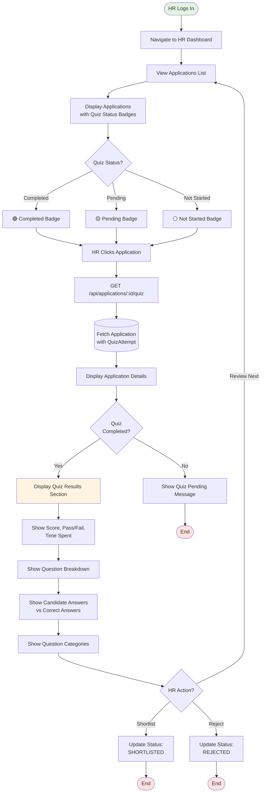
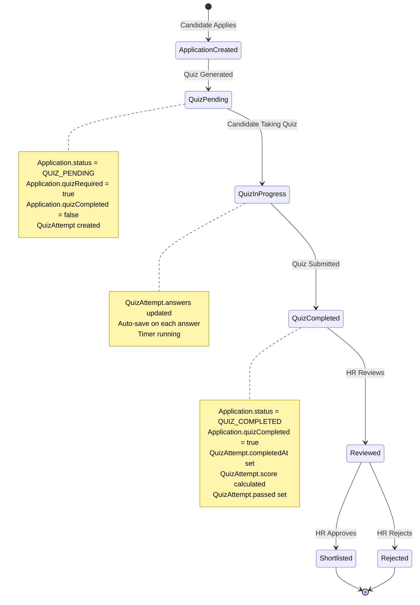
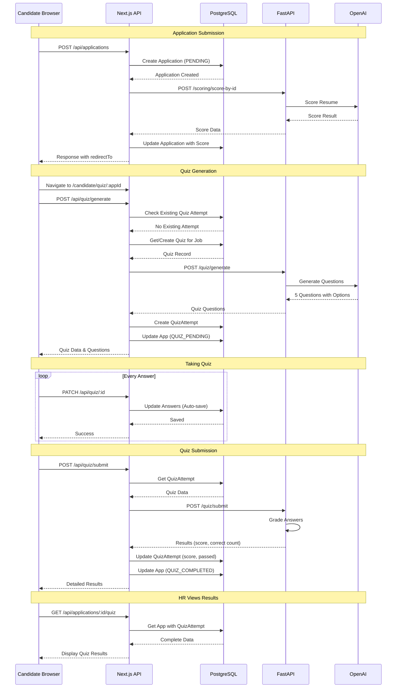
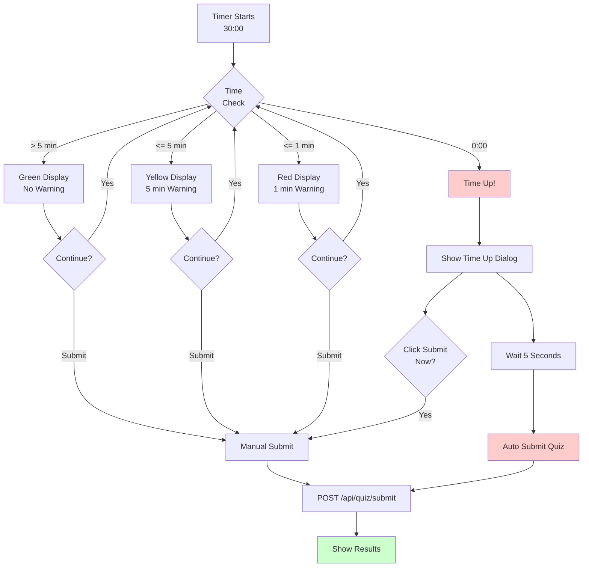

# 📊 Quiz Module - Flow Diagrams

## Complete Quiz Flow (Mermaid)

### Main Application to Quiz Flow

```mermaid
flowchart TD
    Start([Candidate Browses Jobs]) --> Apply[Candidate Clicks Apply]
    Apply --> CheckResume{Has Resume?}

    CheckResume -->|Yes| SelectResume[Select Resume]
    CheckResume -->|No| UploadResume[Upload Resume]

    SelectResume --> SubmitApp[Submit Application]
    UploadResume --> SubmitApp

    SubmitApp --> CreateApp[POST /api/applications]
    CreateApp --> SaveApp[(Save Application<br/>Status: PENDING)]
    SaveApp --> RunScoring[AI Score Resume<br/>FastAPI]
    RunScoring --> UpdateScore[(Update Application<br/>with Score)]
    UpdateScore --> ReturnResponse[Return Response<br/>with redirectTo]

    ReturnResponse --> Redirect[Redirect to<br/>/candidate/quiz/:appId]

    Redirect --> QuizPage[Quiz Page Loads]
    QuizPage --> GenerateQuiz[POST /api/quiz/generate]

    GenerateQuiz --> FetchData[Fetch Application,<br/>Job, Resume Data]
    FetchData --> CheckExisting{Quiz Attempt<br/>Exists?}

    CheckExisting -->|Yes| Error1[Return Error:<br/>Already Generated]
    CheckExisting -->|No| GetQuiz[Get/Create Quiz<br/>for Job]

    GetQuiz --> PrepareData[Prepare Resume Data<br/>for AI]
    PrepareData --> CallFastAPI1[FastAPI:<br/>POST /quiz/generate]

    CallFastAPI1 --> GenerateQuestions[OpenAI Generates<br/>5 Questions]
    GenerateQuestions --> CreateAttempt[(Create QuizAttempt<br/>Store Questions)]
    CreateAttempt --> UpdateStatus1[(Update Application<br/>Status: QUIZ_PENDING)]

    UpdateStatus1 --> ReturnQuiz[Return Quiz Data<br/>to Frontend]
    ReturnQuiz --> DisplayQuiz[Display Quiz Interface]

    DisplayQuiz --> StartTimer[Start 30min Timer]
    StartTimer --> ShowQuestion[Show Question 1/5]

    ShowQuestion --> CandidateAnswer[Candidate Selects Answer]
    CandidateAnswer --> AutoSave[PATCH /api/quiz/:id<br/>Auto-save Answer]
    AutoSave --> SaveProgress[(Save Progress)]

    SaveProgress --> CheckNav{Next or<br/>Previous?}
    CheckNav -->|Previous| ShowPrev[Show Previous Question]
    CheckNav -->|Next| CheckLast{Last Question?}

    ShowPrev --> CandidateAnswer
    CheckLast -->|No| ShowNext[Show Next Question]
    CheckLast -->|Yes| ShowSubmit[Show Submit Button]

    ShowNext --> CandidateAnswer

    ShowSubmit --> CheckAnswered{All Questions<br/>Answered?}
    CheckAnswered -->|No| ShowWarning[Show Warning Dialog]
    CheckAnswered -->|Yes| EnableSubmit[Enable Submit Button]

    ShowWarning --> ConfirmSubmit{Confirm<br/>Submit?}
    ConfirmSubmit -->|No| ShowQuestion
    ConfirmSubmit -->|Yes| SubmitQuiz

    EnableSubmit --> ClickSubmit[Candidate Clicks Submit]
    ClickSubmit --> SubmitQuiz[POST /api/quiz/submit]

    StartTimer --> CheckTime{Time<br/>Remaining?}
    CheckTime -->|< 5 min| ShowWarning1[Show Yellow Warning]
    CheckTime -->|< 1 min| ShowWarning2[Show Red Warning]
    CheckTime -->|0 min| TimeUp[Show Time Up Dialog]

    ShowWarning1 --> CheckTime
    ShowWarning2 --> CheckTime
    TimeUp --> AutoSubmit[Auto-submit After 5s]
    AutoSubmit --> SubmitQuiz

    SubmitQuiz --> ValidateSubmit{Quiz Attempt<br/>Valid?}
    ValidateSubmit -->|No| Error2[Return Error]
    ValidateSubmit -->|Yes| CallFastAPI2[FastAPI:<br/>POST /quiz/submit]

    CallFastAPI2 --> GradeQuiz[Grade Answers<br/>Calculate Score]
    GradeQuiz --> CheckPass{Score >=<br/>Passing?}

    CheckPass -->|Yes| MarkPassed[Set passed = true]
    CheckPass -->|No| MarkFailed[Set passed = false]

    MarkPassed --> UpdateAttempt
    MarkFailed --> UpdateAttempt

    UpdateAttempt[(Update QuizAttempt<br/>score, passed, completedAt)]
    UpdateAttempt --> UpdateStatus2[(Update Application<br/>Status: QUIZ_COMPLETED)]
    UpdateStatus2 --> ReturnResults[Return Detailed Results]

    ReturnResults --> DisplayResults[Display Results Page]
    DisplayResults --> ShowScore[Show Overall Score]
    ShowScore --> ShowBreakdown[Show Question Breakdown]
    ShowBreakdown --> ShowExplanations[Show Explanations]
    ShowExplanations --> ShowActions[Show Action Buttons]

    ShowActions --> CandidateChoice{Candidate<br/>Chooses?}
    CandidateChoice -->|Dashboard| Dashboard[Go to Dashboard]
    CandidateChoice -->|Browse Jobs| BrowseJobs[Browse More Jobs]

    Dashboard --> End1([End])
    BrowseJobs --> End2([End])
    Error1 --> End3([End])
    Error2 --> End4([End])

    style Start fill:#e1f5e1
    style End1 fill:#ffe1e1
    style End2 fill:#ffe1e1
    style End3 fill:#ffe1e1
    style End4 fill:#ffe1e1
    style DisplayResults fill:#fff4e1
    style SubmitQuiz fill:#e1f0ff
    style CallFastAPI1 fill:#f0e1ff
    style CallFastAPI2 fill:#f0e1ff
```



### HR View Quiz Results Flow



### Database State Flow



### API Interaction Sequence



### Component Interaction Diagram

```mermaid
graph TB
    subgraph "Quiz Assessment Page"
        QP[QuizAssessmentPage<br/>Main Container]
        QT[QuizTimer<br/>Countdown]
        QPS[QuizProgress<br/>Visual Tracker]
        QC[QuizCard<br/>Question Display]
        QN[QuizNavigation<br/>Controls]
        QR[QuizResults<br/>Results Display]
    end

    subgraph "API Routes"
        GEN[/api/quiz/generate]
        SUB[/api/quiz/submit]
        GET[/api/quiz/:id]
        APPQ[/api/applications/:id/quiz]
    end

    subgraph "Database"
        APP[(Application)]
        QA[(QuizAttempt)]
        QZ[(Quiz)]
        CAND[(Candidate)]
    end

    subgraph "FastAPI Services"
        QGEN[Quiz Generation Service]
        QSUB[Quiz Submission Service]
    end

    QP --> QT
    QP --> QPS
    QP --> QC
    QP --> QN
    QP --> QR

    QP -.->|POST| GEN
    GEN --> QGEN
    QGEN --> QZ
    QGEN --> APP
    QGEN --> QA

    QP -.->|PATCH Auto-save| GET
    GET --> QA

    QP -.->|POST| SUB
    SUB --> QSUB
    QSUB --> QA
    QSUB --> APP

    APPQ --> APP
    APPQ --> QA
    APPQ --> CAND

    style QP fill:#e1f0ff
    style GEN fill:#fff4e1
    style SUB fill:#fff4e1
    style QGEN fill:#f0e1ff
    style QSUB fill:#f0e1ff
```

### Timer and Auto-Submit Logic


